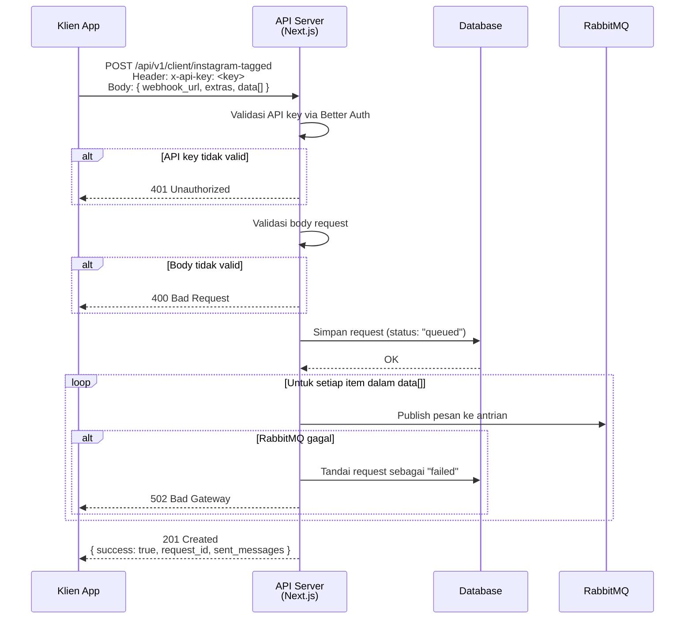
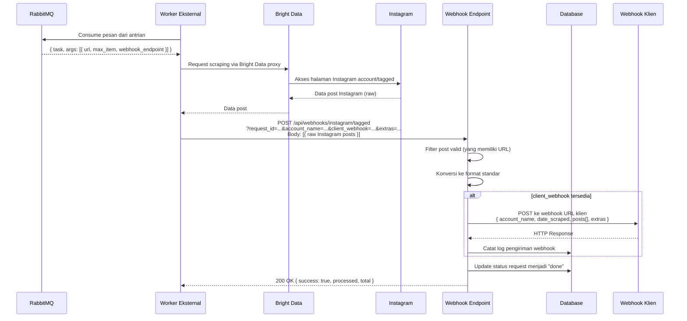

# Alur Scraper Instagram — Dokumentasi Teknis

> Versi: Next-Scraper  
> Bahasa: Bahasa Indonesia  
> Terakhir diperbarui: 2026-06-18

---

## Daftar Isi

1. [Gambaran Umum](#1-gambaran-umum)
2. [Alur Lengkap (End-to-End)](#2-alur-lengkap-end-to-end)
3. [Diagram Alur Sekuensial](#3-diagram-alur-sekuensial)
4. [Detail Setiap Tahap](#4-detail-setiap-tahap)
5. [Kegagalan yang Mungkin Terjadi](#5-kegagalan-yang-mungkin-terjadi)
6. [Di Mana Harus Memeriksa Masalah](#6-di-mana-harus-memeriksa-masalah)
7. [Cara Klien Menggunakan API](#7-cara-klien-menggunakan-api)

---

## 1. Gambaran Umum

Scraper Instagram berjalan melalui arsitektur **berbasis antrian (queue-based)**. Klien mengirim permintaan scraping melalui API, lalu sistem mempublikasikan pesan ke **RabbitMQ**. Worker eksternal (mobile/server) mengkonsumsi antrian, melakukan scraping ke Instagram via **Bright Data**, dan mengirimkan hasilnya kembali ke server melalui **webhook**.

```
Klien → API Server → RabbitMQ → Worker Eksternal → Instagram (via Bright Data) → Webhook → Klien
```

**Komponen Utama:**

| Komponen | Keterangan |
|---|---|
| API Server (Next.js) | Menerima permintaan klien dan mempublikasikan ke RabbitMQ |
| RabbitMQ | Antrian pesan antara server dan worker |
| Worker Eksternal | Scraper yang mengkonsumsi antrian dan melakukan scraping |
| Bright Data | Proxy/infrastruktur scraping untuk bypass proteksi Instagram |
| Webhook Endpoint | Menerima hasil scraping dari worker |
| Database & Dashboard | Menyimpan status request dan log pengiriman |

---

## 2. Alur Lengkap (End-to-End)

```
1. Klien mengirim POST /api/v1/client/instagram-tagged
         ↓
2. Server memvalidasi API key (header x-api-key)
         ↓
3. Server menyimpan request ke database (status: "queued")
         ↓
4. Server mempublikasikan pesan ke RabbitMQ (satu pesan per akun Instagram)
         ↓
5. Worker eksternal mengkonsumsi pesan dari RabbitMQ
         ↓
6. Worker melakukan scraping via Bright Data ke URL Instagram
         ↓
7. Worker mengirim hasil ke webhook callback
         ↓
8. Server menerima hasil di endpoint webhook
         ↓
9. Server memfilter & mengkonversi data hasil scraping
         ↓
10. Server meneruskan data ke webhook klien
         ↓
11. Server memperbarui status request menjadi "done"
         ↓
12. Server mencatat hasil pengiriman ke log
```

---

## 3. Diagram Alur Sekuensial

### 3.1 Alur Pengiriman Permintaan (Request Phase)



### 3.2 Alur Scraping & Penerimaan Hasil (Processing Phase)



---

## 4. Detail Setiap Tahap

### Tahap 1 — Klien Mengirim Permintaan

**Endpoint:** `POST /api/v1/client/instagram-tagged`

**Header yang dibutuhkan:**
```
x-api-key: <api-key-klien>
```

**Body request:**
```json
{
  "webhook_url": "https://app-klien.com/webhook/instagram",
  "extras": {
    "listen_group_id": 1,
    "request_data_id": 42,
    "catatan": "scraping Q1 2024"
  },
  "data": [
    {
      "identifier": "savearth",
      "date_start": "2024-01-01",
      "date_end": "2024-12-31",
      "data_size": 100
    },
    {
      "identifier": "ocean"
    }
  ]
}
```

**Aturan validasi:**
- `data` wajib diisi, array 1–50 item
- `data[].identifier` wajib diisi (nama akun Instagram, tanpa `@`)
- `webhook_url` opsional — jika tidak ada, hasil scraping hanya disimpan di log
- `extras` opsional — akan diteruskan apa adanya ke webhook klien

---

### Tahap 2 — Penyimpanan Request ke Database

Request disimpan ke database dengan data berikut:

| Field | Nilai |
|---|---|
| ID | UUID acak (primary key) |
| Status | `"queued"` |
| Requestor | ID pengguna/API key |
| Webhook URL | URL webhook klien |
| Extras | JSON bebas dari klien |
| Data | Payload asli data[] |
| Waktu | Waktu sekarang |

Data ini dapat dilihat di dashboard admin → halaman **Request Log**.

---

### Tahap 3 — Publikasi ke RabbitMQ

Untuk setiap item dalam `data[]`, server membangun pesan dan mempublikasikannya ke antrian:

**Format pesan yang dikirim ke worker:**
```json
{
  "task": "run_instagram_listing_scraper",
  "args": [
    {
      "url": "https://www.instagram.com/savearth/tagged",
      "max_item": 100,
      "webhook_endpoint": "https://api-server.com/api/webhooks/instagram/tagged?request_id=abc&account_name=savearth&client_webhook=https%3A%2F%2Fapp-klien.com%2Fwebhook&extras=%7B...%7D"
    }
  ]
}
```

**Antrian yang digunakan:**
- Nama antrian dikonfigurasi melalui environment variable `REQUEST_QUEUE_NAME`
- Exchange default RabbitMQ, publish via HTTP API RabbitMQ

---

### Tahap 4 — Worker Melakukan Scraping

Worker eksternal (berjalan secara independen, tidak dikelola oleh server ini) akan:

1. Mengkonsumsi pesan dari antrian
2. Membaca URL Instagram dari pesan
3. Menggunakan Bright Data sebagai proxy untuk mengakses Instagram
4. Mengumpulkan post hingga jumlah maksimal yang diminta
5. Mengirimkan hasilnya ke URL webhook yang ada di pesan

---

### Tahap 5 — Server Menerima Hasil via Webhook

**Endpoint:** `POST /api/webhooks/instagram/tagged`

**Query params yang diterima:**
- `request_id` — ID request asal
- `account_name` — nama akun Instagram yang di-scrape
- `client_webhook` — URL webhook klien (URL-encoded)
- `extras` — data extras dari request awal (URL-encoded JSON)

**Proses:**
1. Menerima array post Instagram mentah dari worker
2. Memfilter post yang tidak memiliki URL (dibuang)
3. Mengkonversi setiap post ke format standar
4. Jika `client_webhook` ada: meneruskan ke webhook klien
5. Mencatat hasil pengiriman ke log (dapat dilihat di dashboard → **Webhook Log**)
6. Memperbarui status request menjadi `"done"` (dapat dilihat di dashboard → **Request Log**)

---

### Tahap 6 — Payload yang Diterima Klien di Webhooknya

Klien akan menerima POST ke webhook URL mereka dengan format:

```json
{
  "account_name": "savearth",
  "date_scraped": "2024-01-15T10:30:00.000Z",
  "posts": [
    {
      "url": "https://www.instagram.com/p/ABC123/",
      "shortcode": "ABC123",
      "post_id": "123456789",
      "user_posted": "savearth",
      "description": "Teks caption postingan...",
      "likes": 1500,
      "num_comments": 45,
      "hashtags": ["#saveearth", "#nature", "#ocean"],
      "photos": ["https://cdn.instagram.com/..."],
      "videos": null,
      "tagged_users": [
        { "username": "user123", "id": "..." }
      ],
      "timestamp": "2024-01-10T08:00:00.000Z"
    }
  ],
  "extras": {
    "listen_group_id": 1,
    "request_data_id": 42
  }
}
```

---

## 5. Kegagalan yang Mungkin Terjadi

### 5.1 Kegagalan Koneksi RabbitMQ

**Gejala:** API mengembalikan `502 Bad Gateway`  
**Penyebab:** Server tidak dapat terhubung ke RabbitMQ saat mempublikasikan pesan  
**Dampak:** Request tersimpan di database dengan status `"failed"`, tidak ada pesan yang dikirim ke worker  
**Cara mendeteksi:** Response body akan berisi pesan error koneksi RabbitMQ; status request di dashboard akan `"failed"`

---

### 5.2 Tidak Ada Worker (Consumer = 0)

**Gejala:** Request status tetap `"queued"` selamanya, webhook klien tidak pernah dipanggil  
**Penyebab:** Tidak ada worker yang mengkonsumsi antrian RabbitMQ (worker mati, restart, atau tidak terdeploy)  
**Dampak:** Pesan menumpuk di antrian, tidak diproses  
**Cara mendeteksi:**
- Cek dashboard admin → **Worker Status** → jumlah consumer = 0
- Notifikasi Telegram otomatis dikirim jika kondisi ini bertahan lebih dari 1 jam

---

### 5.3 Scraping Gagal di Sisi Worker

**Gejala:** Webhook tidak pernah dipanggil meskipun worker aktif  
**Penyebab:** Worker gagal scraping (Instagram rate-limit, Bright Data error, timeout)  
**Dampak:** Request tetap di status `"queued"`, tidak ada hasil  
**Cara mendeteksi:** Cek log worker eksternal (di luar cakupan server ini)

---

### 5.4 Webhook Klien Tidak Dapat Dihubungi

**Gejala:** Data terproses di server tapi klien tidak menerima  
**Penyebab:** Endpoint webhook klien down, timeout, atau mengembalikan error HTTP  
**Dampak:** Status request berubah ke `"done"` di server, tapi data tidak sampai ke klien  
**Cara mendeteksi:** Cek dashboard admin → **Webhook Log** — lihat kolom status code dan pesan error

---

### 5.5 Hasil Scraping Kosong / Tidak Valid

**Gejala:** Webhook klien dipanggil tapi `posts[]` kosong atau lebih sedikit dari yang diharapkan  
**Penyebab:** Post tidak memiliki URL (difilter), atau Instagram membatasi hasil  
**Dampak:** Data tidak lengkap  
**Cara mendeteksi:** Cek dashboard → **Webhook Log** — bandingkan jumlah data valid vs total yang diterima dari worker

---

### 5.6 Request Duplikat

**Gejala:** Klien mengirim request yang sama dua kali  
**Dampak:** Dua pesan masuk ke RabbitMQ, worker memproses dua kali, webhook klien dipanggil dua kali  
**Catatan:** Sistem saat ini tidak memiliki deduplication otomatis di level request Instagram

---

## 6. Di Mana Harus Memeriksa Masalah

### 6.1 Status Request

**Dashboard:** Admin → **Request Log**  
- Filter berdasarkan tanggal
- Lihat status tiap request: `queued`, `done`, atau `failed`

**Via API:**
```bash
GET /api/v1/internal/request-log?date_from=2024-01-15&date_to=2024-01-16
```

---

### 6.2 Status Worker / Antrian RabbitMQ

**Dashboard:** Admin → **Worker Status**

**Via API:**
```bash
GET /api/v1/internal/instagram/worker-status
```

**Contoh respons:**
```json
{
  "queues": {
    "request": {
      "name": "scrape_request_listing",
      "consumers": 2,
      "messages": 15
    },
    "response": {
      "name": "scrape_response_listing",
      "consumers": 1,
      "messages": 0
    }
  }
}
```

**Interpretasi:**
- `consumers: 0` + `messages > 0` → Worker tidak aktif, pesan menumpuk ⚠️
- `consumers > 0` + `messages` terus bertambah → Worker tidak mampu mengikuti volume ⚠️
- `consumers > 0` + `messages` turun → Normal ✅

---

### 6.3 Log Pengiriman Webhook

**Dashboard:** Admin → **Webhook Log**  
- Filter berdasarkan tanggal
- Lihat status code, jumlah data valid, dan pesan error jika ada

**Via API:**
```bash
GET /api/v1/internal/webhook-log?date_from=2024-01-15&date_to=2024-01-16
```

---

### 6.4 Notifikasi Telegram

Server secara otomatis mengirimkan peringatan ke Telegram jika tidak ada worker yang aktif selama lebih dari 1 jam. Peringatan ini memiliki cooldown 1 jam untuk mencegah spam.

**Konfigurasi:** Environment variable `TELEGRAM_BOT_TOKEN` dan `TELEGRAM_CHAT_ID`

---

## 7. Cara Klien Menggunakan API

### Langkah 1 — Dapatkan API Key

Hubungi admin untuk mendapatkan API key. Sertakan di setiap request melalui header:
```
x-api-key: <api-key-anda>
```

---

### Langkah 2 — Kirim Permintaan Scraping

```bash
curl -X POST https://api-server.com/api/v1/client/instagram-tagged \
  -H "Content-Type: application/json" \
  -H "x-api-key: your_api_key_here" \
  -d '{
    "webhook_url": "https://app-anda.com/webhook/instagram",
    "extras": {
      "listen_group_id": 1,
      "request_data_id": 42
    },
    "data": [
      {
        "identifier": "savearth",
        "date_start": "2024-01-01",
        "date_end": "2024-12-31",
        "data_size": 100
      }
    ]
  }'
```

**Respons sukses (201):**
```json
{
  "success": true,
  "request_id": "uuid-request-anda",
  "sent_messages": 1
}
```

---

### Langkah 3 — Siapkan Endpoint Webhook

Buat endpoint di aplikasi Anda yang dapat menerima POST request:

```javascript
// Contoh Express.js
app.post('/webhook/instagram', express.json(), (req, res) => {
  const { account_name, date_scraped, posts, extras } = req.body;

  console.log(`Menerima ${posts.length} post dari @${account_name}`);
  console.log(`listen_group_id: ${extras.listen_group_id}`);

  // Proses data post...
  posts.forEach(post => {
    console.log(post.url, post.likes, post.description);
  });

  res.status(200).json({ received: true });
});
```

**Penting:**
- Webhook harus merespons dengan HTTP 2xx dalam waktu singkat (hindari timeout)
- Jika butuh proses lama, balas 200 dahulu lalu proses secara asinkron
- Webhook dapat dipanggil beberapa kali jika ada beberapa akun dalam satu request

---

### Langkah 4 — Pantau Status Request (Opsional)

```bash
# Lihat semua job yang pernah dikirim
curl https://api-server.com/api/v1/client/tiktok-jobs \
  -H "x-api-key: your_api_key_here"
```

---

### Rate Limiting

- Batas default: **100 request per menit** per API key
- Jika melebihi batas: server mengembalikan `429 Too Many Requests`
- Hubungi admin untuk menaikkan batas jika dibutuhkan

---

### Ringkasan Endpoint untuk Klien

| Method | Endpoint | Keterangan |
|---|---|---|
| `POST` | `/api/v1/client/instagram-tagged` | Kirim permintaan scraping |
| `GET` | `/api/v1/client/tiktok-jobs` | Lihat daftar job yang pernah dikirim |
| `GET` | `/api/v1/client/tiktok-jobs/:id` | Detail satu job |
| `PATCH` | `/api/v1/client/tiktok-jobs/:id` | Update webhook URL / extras |
| `DELETE` | `/api/v1/client/tiktok-jobs/:id` | Hapus job |
