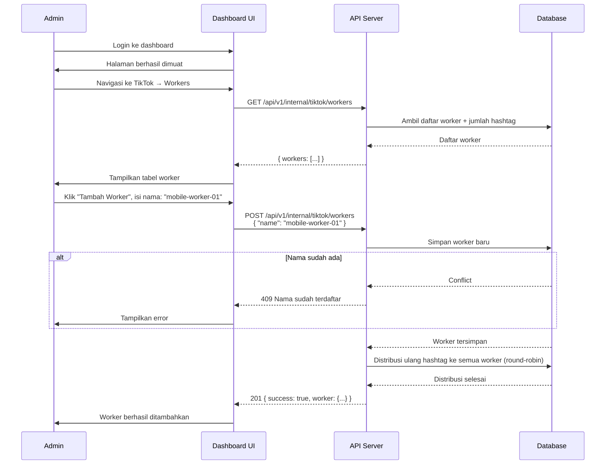
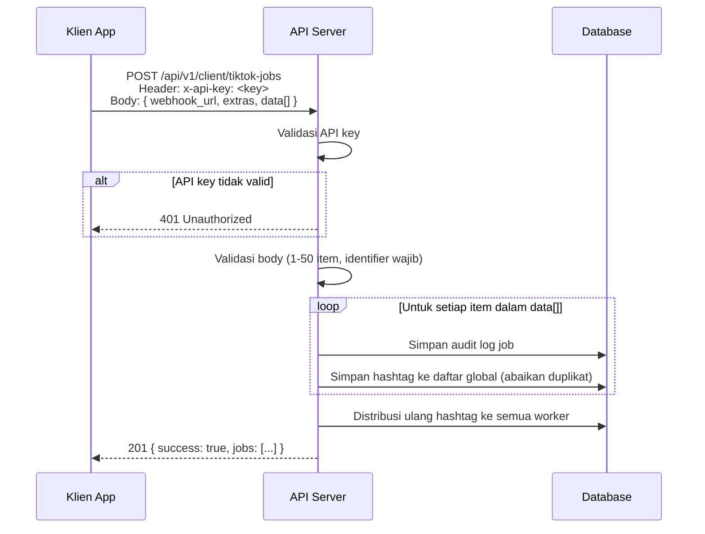
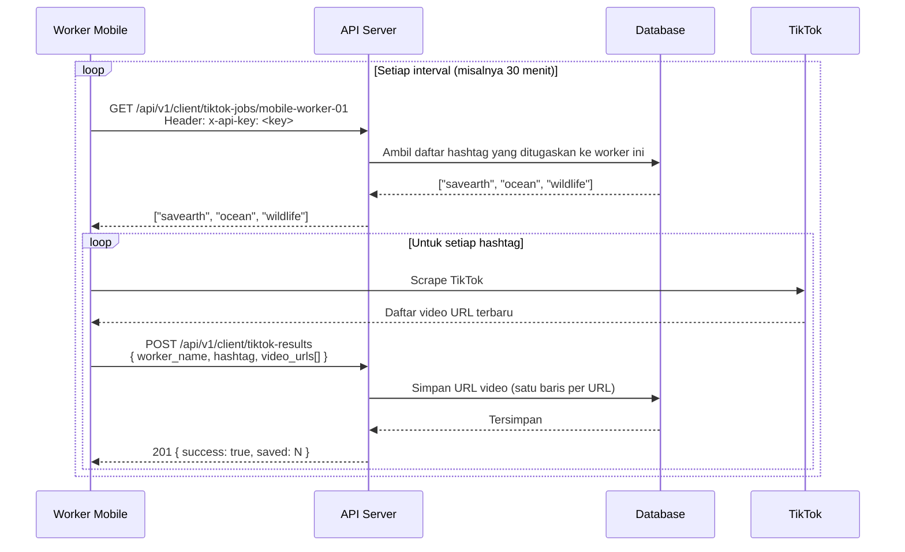
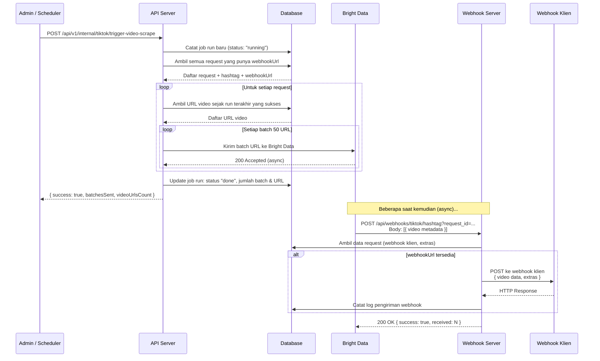

# Alur Scraper TikTok — Dokumentasi Teknis

> Versi: Next-Scraper  
> Bahasa: Bahasa Indonesia  
> Terakhir diperbarui: 2026-06-18

---

## Daftar Isi

1. [Gambaran Umum](#1-gambaran-umum)
2. [Alur Pendaftaran Worker oleh Admin](#2-alur-pendaftaran-worker-oleh-admin)
3. [Alur Lengkap Scraping TikTok](#3-alur-lengkap-scraping-tiktok)
4. [Diagram Alur Sekuensial](#4-diagram-alur-sekuensial)
5. [Detail Setiap Tahap](#5-detail-setiap-tahap)
6. [Algoritma Rebalancing](#6-algoritma-rebalancing)
7. [Kegagalan yang Mungkin Terjadi](#7-kegagalan-yang-mungkin-terjadi)
8. [Di Mana Harus Memeriksa Masalah](#8-di-mana-harus-memeriksa-masalah)
9. [Cara Klien Menggunakan API](#9-cara-klien-menggunakan-api)

---

## 1. Gambaran Umum

Scraper TikTok menggunakan arsitektur **mobile worker berbasis polling**. Berbeda dengan Instagram yang menggunakan RabbitMQ, TikTok menggunakan model di mana worker mobile secara aktif menanyakan ("polling") ke server untuk mendapatkan daftar hashtag yang harus mereka scrape.

Proses scraping TikTok berjalan dalam **dua fase terpisah**:
1. **Fase Koleksi URL Video** — Worker mobile men-scrape TikTok dan melaporkan URL video yang ditemukan
2. **Fase Scraping Metadata Video** — Server mengambil metadata detail untuk setiap URL via Bright Data (dipicu secara manual atau terjadwal)

```
[Klien]         → Daftarkan hashtag
[Admin]         → Daftarkan worker mobile
[Sistem]        → Distribusikan hashtag ke worker (rebalancing)
[Worker Mobile] → Polling → Scrape TikTok → Lapor URL video
[Admin/Jadwal]  → Trigger batch scraping via Bright Data
[Bright Data]   → Kirim metadata video ke webhook
[Sistem]        → Teruskan data ke webhook klien
```

**Komponen Utama:**

| Komponen | Keterangan |
|---|---|
| API Server (Next.js) | Orkestrasi: menerima request, mendistribusikan tugas, menerima hasil |
| Mobile Worker | Aplikasi di perangkat mobile yang men-scrape TikTok langsung |
| Bright Data | Layanan scraping untuk mengambil metadata video dari URL yang dikumpulkan |
| Database & Dashboard | Menyimpan worker, hashtag, assignment, URL hasil, dan log |

---

## 2. Alur Pendaftaran Worker oleh Admin

Sebelum sistem dapat berjalan, admin harus mendaftarkan worker mobile secara manual melalui dashboard. Ini adalah langkah **satu kali saat pertama kali setup** atau saat menambah worker baru.

### 2.1 Langkah-Langkah Pendaftaran Worker

```
Admin Login → Dashboard TikTok → Tambah Worker → Masukkan Nama Worker → Sistem Menyimpan & Rebalancing
```

**Langkah 1 — Login ke Dashboard**

Admin mengakses dashboard via browser dan login menggunakan email dan password.

**Langkah 2 — Navigasi ke Halaman TikTok Workers**

Di sidebar dashboard, pilih menu TikTok → Mobile Workers.

**Langkah 3 — Tambah Worker Baru**

Klik tombol "Tambah Worker" dan masukkan nama unik untuk worker, nama ihi harus sama dengan nama yg terdapat di dalam worker handphone.

**Langkah 4 — Sistem Menyimpan Worker & Menjalankan Rebalancing**

Server menyimpan worker baru ke database dan secara otomatis mendistribusikan ulang semua hashtag ke semua worker yang aktif. Hasilnya dapat dilihat langsung di dashboard.

### 2.2 Diagram Pendaftaran Worker



### 2.3 Menghapus Worker

Jika sebuah worker tidak lagi aktif atau perlu dihapus, gunakan tombol hapus di dashboard atau via API:

Saat worker dihapus, semua assignment hashtag untuk worker tersebut otomatis hilang dan rebalancing dijalankan — hashtag didistribusikan ulang ke worker yang tersisa.

---

## 3. Alur Lengkap Scraping TikTok

### Fase 1: Setup (Dilakukan Sekali)

```
1. Admin mendaftarkan worker mobile via dashboard
2. Klien (atau Admin) mendaftarkan hashtag yang ingin di-scrape
3. Sistem otomatis mendistribusikan hashtag ke worker (rebalancing)
```

### Fase 2: Operasi Harian Worker

```
4. Worker mobile polling: GET /api/v1/client/tiktok-jobs/:workerName
5. Worker menerima daftar hashtag yang ditugaskan
6. Worker men-scrape TikTok untuk setiap hashtag (cari video terbaru)
7. Worker melaporkan URL video: POST /api/v1/client/tiktok-results
8. Server menyimpan URL ke database
9. Ulangi dari langkah 4 (periodik)
```

### Fase 3: Batch Scraping Metadata (Dipicu Manual atau Terjadwal)

```
10. Admin/jadwal memicu: POST /api/v1/internal/tiktok/trigger-video-scrape
11. Server mengumpulkan semua URL video sejak run terakhir
12. Server mengirim URL ke Bright Data dalam batch (50 URL per batch)
13. Bright Data men-scrape metadata setiap video
14. Bright Data mengirim hasil ke webhook server
15. Server meneruskan data ke webhook klien
16. Server mencatat log pengiriman
```

---

## 4. Diagram Alur Sekuensial

### 4.1 Alur Klien Mendaftarkan Job Hashtag



### 4.2 Alur Worker Mobile Polling & Melaporkan Hasil



### 4.3 Alur Batch Scraping Metadata via Bright Data



---

## 5. Detail Setiap Tahap

### Tahap A — Klien Mendaftarkan Hashtag

**Endpoint:** `POST /api/v1/client/tiktok-jobs`

**Body request:**
```json
{
  "webhook_url": "https://app-klien.com/webhook/tiktok",
  "extras": {
    "listen_group_id": 5,
    "request_data_id": 101,
    "catatan": "campaign Q1"
  },
  "data": [
    {
      "identifier": "savearth",
      "date_start": "2024-01-01",
      "date_end": "2024-12-31",
      "data_size": 200
    },
    { "identifier": "ocean" },
    { "identifier": "wildlife" }
  ]
}
```

**Aturan validasi:**
- `data` wajib, array 1–50 item
- `data[].identifier` wajib (nama hashtag TikTok, tanpa `#`)
- `webhook_url` opsional
- Pengiriman duplikat (identifier yang sama) diabaikan secara otomatis

**Yang terjadi:**
1. Audit log submission disimpan ke database
2. Hashtag baru ditambahkan ke daftar global
3. Rebalancing otomatis dijalankan — hasil dapat dilihat di dashboard → **TikTok → Hashtags**

---

### Tahap B — Worker Mobile Mendapatkan Tugas

**Endpoint:** `GET /api/v1/client/tiktok-jobs/:workerName`

**Contoh:**
```
GET /api/v1/client/tiktok-jobs/mobile-worker-01
Header: x-api-key: <key>
```

**Respons:**
```json
["savearth", "ocean", "wildlife"]
```

Worker menggunakan daftar ini untuk menentukan hashtag mana yang harus di-scrape pada sesi berikutnya.

---

### Tahap C — Worker Melaporkan URL Video

**Endpoint:** `POST /api/v1/client/tiktok-results`

```json
{
  "worker_name": "mobile-worker-01",
  "hashtag": "savearth",
  "video_urls": [
    "https://www.tiktok.com/@user1/video/7123456789",
    "https://www.tiktok.com/@user2/video/7987654321"
  ]
}
```

Setiap URL disimpan secara terpisah ke database dan dapat dilihat di dashboard → **TikTok → Results**.

---

### Tahap D — Trigger Batch Scraping Metadata

**Endpoint:** `POST /api/v1/internal/tiktok/trigger-video-scrape`

**Yang terjadi:**
1. Server membuat catatan job run baru dengan status `"running"` — dapat dilihat di dashboard → **TikTok → Scrape Jobs**
2. Server mengumpulkan semua URL video yang belum diproses sejak run sukses terakhir
3. URL dibagi menjadi batch (50 URL per batch)
4. Setiap batch dikirim ke Bright Data API untuk di-scrape secara asinkron
5. Setelah selesai, status job run diperbarui menjadi `"done"` beserta statistiknya

---

## 6. Algoritma Rebalancing

Rebalancing adalah proses redistribusi hashtag ke worker secara merata. Ini dijalankan **otomatis** setiap kali ada perubahan pada worker atau hashtag.

### Algoritma Round-Robin

```
1. Ambil semua worker (urut dari yang paling lama dibuat)
2. Ambil semua hashtag (urut dari yang paling lama dibuat)
3. Jika worker atau hashtag kosong → hapus semua assignment, selesai
4. Hapus semua assignment yang ada
5. Untuk setiap hashtag[i], assign ke workers[i % jumlah_worker]
6. Simpan semua assignment baru (dalam satu transaksi)
```

### Ilustrasi dengan 3 Worker dan 7 Hashtag

| Hashtag (urut didaftarkan) | Ditugaskan ke |
|---|---|
| #savearth | Worker-A |
| #ocean | Worker-B |
| #wildlife | Worker-C |
| #nature | Worker-A |
| #forest | Worker-B |
| #earth | Worker-C |
| #green | Worker-A |

**Hasilnya:**
- Worker-A: `#savearth`, `#nature`, `#green` (3 hashtag)
- Worker-B: `#ocean`, `#forest` (2 hashtag)
- Worker-C: `#wildlife`, `#earth` (2 hashtag)

Selisih paling banyak 1 hashtag antar worker adalah perilaku **normal** dari algoritma ini.

### Kapan Rebalancing Dipicu

| Aksi | Rebalancing? |
|---|---|
| Worker baru ditambahkan | ✅ Ya |
| Worker dihapus | ✅ Ya |
| Hashtag baru didaftarkan (via POST job) | ✅ Ya |
| Hashtag dihapus | ✅ Ya |
| Worker melaporkan hasil URL | ❌ Tidak |
| Trigger batch scraping | ❌ Tidak |

---

## 7. Kegagalan yang Mungkin Terjadi

### 7.1 Worker Tidak Ada / Belum Terdaftar

**Gejala:** Hashtag tidak diproses sama sekali  
**Penyebab:** Admin belum mendaftarkan worker, atau semua worker dihapus  
**Dampak:** Tidak ada yang polling, hashtag terakumulasi tanpa diproses  
**Cara mendeteksi:** Dashboard → TikTok → Workers → terlihat daftar kosong

---

### 7.2 Worker Mobile Offline / Tidak Polling

**Gejala:** Hashtag terdaftar dan ada assignment, tapi tidak ada URL video baru yang masuk  
**Penyebab:** Perangkat mobile mati, aplikasi crash, koneksi internet terputus  
**Dampak:** URL video tidak terkumpul; jika batch scraping dipicu, hanya URL lama yang diproses  
**Cara mendeteksi:** Dashboard → TikTok → Scraped Results → lihat kapan URL terakhir masuk; jika sudah beberapa jam tidak ada yang baru, worker kemungkinan offline

---

### 7.3 Distribusi Hashtag Tidak Merata

**Gejala:** Beberapa worker mendapat lebih banyak hashtag dari yang lain  
**Penyebab:** Ini adalah perilaku normal — selisih satu hashtag antara worker adalah wajar karena round-robin  
**Catatan:** Jika selisihnya besar, periksa apakah ada worker yang terhapus tanpa rebalancing ulang

---

### 7.4 Bright Data API Gagal saat Trigger Video Scrape

**Gejala:** Trigger batch scraping mengembalikan error  
**Penyebab:** Token Bright Data kadaluarsa, limit API tercapai, atau layanan Bright Data sedang down  
**Dampak:** Job run berstatus `"failed"`, URL video tidak terproses  
**Cara mendeteksi:** Dashboard → TikTok → BrightData Jobs → lihat status job run terakhir

---

### 7.5 Webhook Klien Tidak Dapat Dihubungi

**Gejala:** Data diproses Bright Data dan diterima server, tapi klien tidak menerima  
**Penyebab:** Server klien down, URL webhook salah, atau timeout  
**Dampak:** Data hilang dari sisi klien — server sudah memproses tapi pengiriman gagal  
**Cara mendeteksi:** Dashboard → Webhook Log → lihat status code dan pesan error

---

### 7.6 Duplikat URL Video

**Gejala:** URL video yang sama muncul lebih dari sekali di hasil  
**Penyebab:** Worker melaporkan URL yang sama di sesi berbeda, atau terjadi overlap saat rebalancing  
**Dampak:** Batch scraping akan memproses URL duplikat → data duplikat dikirim ke klien  
**Catatan:** Sistem saat ini tidak memiliki deduplication otomatis untuk URL video

---

### 7.7 Konflik Nama Worker

**Gejala:** Saat menambah worker, muncul error `409`  
**Penyebab:** Nama worker sudah terdaftar sebelumnya  
**Solusi:** Gunakan nama yang berbeda, atau hapus worker lama terlebih dahulu melalui dashboard

---

## 8. Di Mana Harus Memeriksa Masalah

### 8.1 Worker dan Assignment Hashtag

**Dashboard:** TikTok → **Mobile Workers** — tampilkan daftar worker + jumlah hashtag per worker  
**Dashboard:** TikTok → **Hashtags** — tampilkan daftar hashtag + worker yang bertanggung jawab

**Via API:**
```bash
# Lihat semua worker
GET /api/v1/internal/tiktok/workers

# Lihat semua hashtag dan assignment-nya
GET /api/v1/internal/tiktok/hashtags?limit=100
```

---

### 8.2 URL Video yang Terkumpul

**Dashboard:** TikTok → **Results** — filter by hashtag, lihat kapan URL terakhir masuk

**Via API:**
```bash
GET /api/v1/internal/tiktok/results?hashtag=savearth&limit=50
```

---

### 8.3 Riwayat Batch Scraping Job

**Dashboard:** TikTok → **Scrape Jobs** — riwayat run dengan status dan statistik

**Via API:**
```bash
GET /api/v1/internal/tiktok/scrape-jobs?limit=20
```

**Contoh respons:**
```json
{
  "runs": [
    {
      "id": "uuid",
      "startedAt": "2024-01-15T08:00:00Z",
      "completedAt": "2024-01-15T08:05:32Z",
      "status": "done",
      "batchesSent": 12,
      "videoUrlsCount": 580
    }
  ]
}
```

**Interpretasi:**
- `status: "running"` — masih berjalan (normal jika kurang dari 10 menit)
- `status: "done"` — selesai sukses ✅
- `status: "failed"` — ada error saat proses ⚠️

---

### 8.4 Log Pengiriman Webhook

**Dashboard:** Admin → **Webhook Log** — filter by platform TikTok, lihat status code dan error

**Via API:**
```bash
GET /api/v1/internal/webhook-log?date_from=2024-01-15&date_to=2024-01-16
```

---

### 8.5 Audit Log Job Submission

Semua job yang pernah dikirim klien dapat dilihat melalui:

**Dashboard:** Admin → **Request Log**

**Via API:**
```bash
GET /api/v1/internal/tiktok/jobs?limit=50
```

---

## 9. Cara Klien Menggunakan API

### Langkah 1 — Dapatkan API Key

Hubungi admin untuk mendapatkan API key. Sertakan di setiap request:
```
x-api-key: <api-key-anda>
```

---

### Langkah 2 — Daftarkan Hashtag yang Ingin Di-scrape

```bash
curl -X POST https://api-server.com/api/v1/client/tiktok-jobs \
  -H "Content-Type: application/json" \
  -H "x-api-key: your_api_key_here" \
  -d '{
    "webhook_url": "https://app-anda.com/webhook/tiktok",
    "extras": {
      "listen_group_id": 5,
      "request_data_id": 101
    },
    "data": [
      { "identifier": "savearth", "date_start": "2024-01-01", "date_end": "2024-12-31" },
      { "identifier": "ocean" },
      { "identifier": "wildlife" }
    ]
  }'
```

**Respons sukses (201):**
```json
{
  "success": true,
  "jobs": [
    { "id": "uuid-1", "hashtag": "savearth" },
    { "id": "uuid-2", "hashtag": "ocean" },
    { "id": "uuid-3", "hashtag": "wildlife" }
  ]
}
```

---

### Langkah 3 — Siapkan Endpoint Webhook

Klien harus menyiapkan endpoint yang menerima POST dari server ketika metadata video selesai di-scrape oleh Bright Data:

```javascript
// Contoh Express.js
app.post('/webhook/tiktok', express.json(), (req, res) => {
  const videos = req.body; // Array metadata video TikTok

  videos.forEach(video => {
    console.log(video.url, video.author, video.likes);
    // Simpan ke database Anda...
  });

  res.status(200).json({ received: true });
});
```

**Penting:**
- Webhook dipanggil **setelah** system memicu batch scraping brightdata (Fase 3)
- Ada jeda waktu antara pendaftaran hashtag → URL terkumpul → metadata di-scrape → webhook klien dipanggil
- Webhook dipanggil secara asinkron oleh Bright Data — bukan real-time

---

### Langkah 4 — Pantau dan Kelola Job

```bash
# Lihat semua job yang pernah didaftarkan
curl https://api-server.com/api/v1/client/tiktok-jobs \
  -H "x-api-key: your_api_key_here"

# Update webhook URL untuk job tertentu
curl -X PATCH https://api-server.com/api/v1/client/tiktok-jobs/uuid-job \
  -H "Content-Type: application/json" \
  -H "x-api-key: your_api_key_here" \
  -d '{ "webhook_url": "https://app-anda.com/webhook/tiktok-v2" }'

# Hapus job
curl -X DELETE https://api-server.com/api/v1/client/tiktok-jobs/uuid-job \
  -H "x-api-key: your_api_key_here"
```

---

### Ekspektasi Waktu (Timeline)

| Fase | Estimasi Waktu |
|---|---|
| Hashtag terdaftar → Worker mulai scraping | Tergantung interval polling worker (biasanya 30 menit - 1 jam) |
| Worker mulai scraping → URL video terkumpul | Tergantung volume TikTok (menit - jam) |
| URL terkumpul → Admin trigger batch scrape | Manual atau terjadwal (harian/mingguan) |
| Batch scrape dimulai → Webhook klien dipanggil | Tergantung Bright Data (menit - beberapa jam) |

---

### Rate Limiting

- Batas default: **100 request per menit** per API key
- Jika melebihi batas: server mengembalikan `429 Too Many Requests`

---

### Ringkasan Endpoint untuk Klien

| Method | Endpoint | Keterangan |
|---|---|---|
| `POST` | `/api/v1/client/tiktok-jobs` | Daftarkan hashtag untuk di-scrape |
| `GET` | `/api/v1/client/tiktok-jobs` | Lihat semua job yang pernah didaftarkan |
| `GET` | `/api/v1/client/tiktok-jobs/:id` | Detail satu job |
| `PATCH` | `/api/v1/client/tiktok-jobs/:id` | Update webhook URL / extras |
| `DELETE` | `/api/v1/client/tiktok-jobs/:id` | Hapus job |

---

### Ringkasan Endpoint Admin (Membutuhkan Login Dashboard)

| Method | Endpoint | Keterangan |
|---|---|---|
| `GET` | `/api/v1/internal/tiktok/workers` | Lihat daftar worker mobile |
| `POST` | `/api/v1/internal/tiktok/workers` | Daftarkan worker mobile baru |
| `DELETE` | `/api/v1/internal/tiktok/workers/:name` | Hapus worker |
| `GET` | `/api/v1/internal/tiktok/hashtags` | Lihat semua hashtag + assignment |
| `POST` | `/api/v1/internal/tiktok/hashtags` | Tambah hashtag manual |
| `DELETE` | `/api/v1/internal/tiktok/hashtags/:id` | Hapus hashtag |
| `GET` | `/api/v1/internal/tiktok/results` | Lihat URL video yang terkumpul |
| `GET` | `/api/v1/internal/tiktok/scrape-jobs` | Riwayat batch scraping |
| `POST` | `/api/v1/internal/tiktok/trigger-video-scrape` | Picu batch scraping metadata |
| `GET` | `/api/v1/internal/webhook-log` | Log pengiriman webhook |
